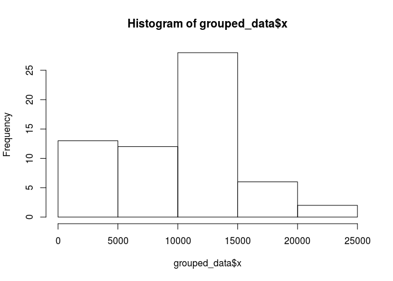
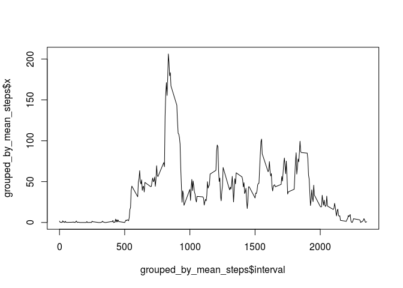
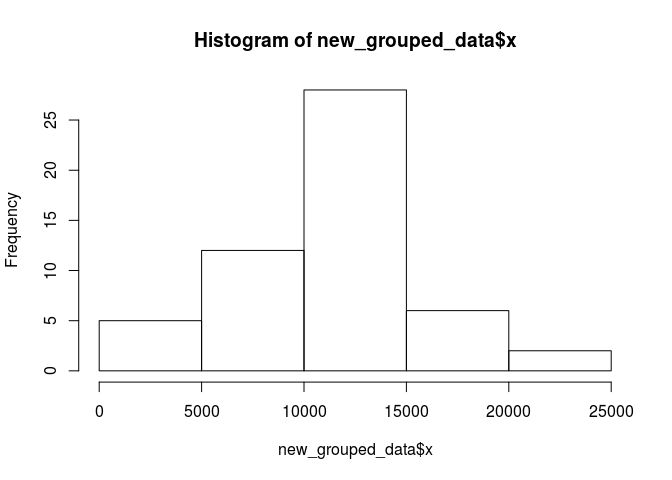
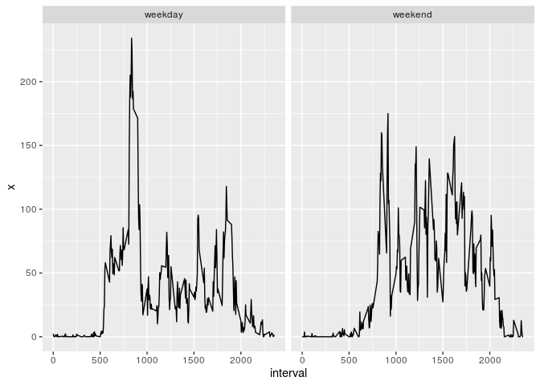

## Loading and preprocessing the data


```r
data <- read.csv(unz("activity.zip",filename = "activity.csv"))
```

## What is mean total number of steps taken per day?


```r
grouped_data <- aggregate(data$steps, by=list(date = data$date), FUN=sum, na.rm=TRUE)

hist(grouped_data$x)
```

<!-- -->

```r
summary(grouped_data$x)
```

```
##    Min. 1st Qu.  Median    Mean 3rd Qu.    Max. 
##       0    6778   10395    9354   12811   21194
```

## What is the average daily activity pattern?


```r
grouped_by_mean_steps <- aggregate(data$steps, by=list(interval = data$interval), FUN=mean, na.rm=TRUE)

plot(grouped_by_mean_steps$interval, grouped_by_mean_steps$x, type="l")
```

<!-- -->

## Imputing missing values


```r
new_data <- data

new_grouped_data <- aggregate(new_data$steps, by=list(date = new_data$date), FUN=sum)

hist(new_grouped_data$x)
```

<!-- -->

```r
summary(new_grouped_data$x)
```

```
##    Min. 1st Qu.  Median    Mean 3rd Qu.    Max.    NA's 
##      41    8841   10765   10766   13294   21194       8
```

## Are there differences in activity patterns between weekdays and weekends?


```r
new_data$day<-weekdays(as.Date(new_data$date), abbreviate = TRUE)

new_data$day[new_data$day=="seg"]<-"weekday"
new_data$day[new_data$day=="ter"]<-"weekday"
new_data$day[new_data$day=="qua"]<-"weekday"
new_data$day[new_data$day=="qui"]<-"weekday"
new_data$day[new_data$day=="sex"]<-"weekday"
new_data$day[new_data$day=="sáb"]<-"weekend"
new_data$day[new_data$day=="dom"]<-"weekend"

new_grouped_by_mean_steps <- aggregate(new_data$steps, by=list(interval = new_data$interval, day = new_data$day), FUN=mean, na.rm=TRUE)

ggplot2::ggplot(new_grouped_by_mean_steps) +  ggplot2::aes(x=interval, y=x) + ggplot2::facet_grid(~day) + ggplot2::geom_line()
```

<!-- -->
